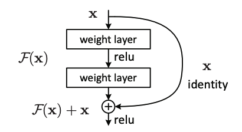
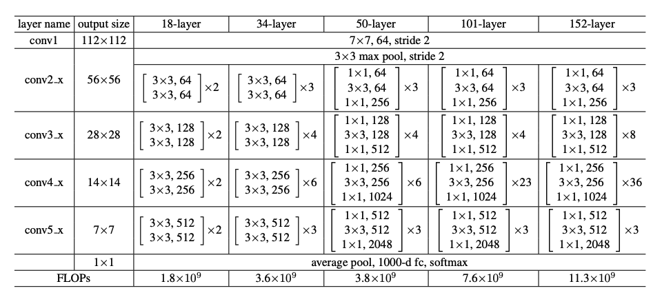

# ResNet18, ResNet34, ResNet50 and ResNet101 implementations written from scratch in PyTorch

Models based on the whitepaper `'Deep Residual Learning for Image Recognition'` by Kaiming He, Xiangyu Zhang, Shaoqing Ren, & Jian Sun at Microsoft Research. Training logic set up for the CIFAR 10 dataset available through `torchvision`, but could be easily adjusted for CIFAR 100 or other image classification datasets.

Link to the paper: https://arxiv.org/pdf/1512.03385.pdf
# Summary
The paper addresses the degradation problem by
introducing a deep residual learning framework. Instead of hoping each few stacked layers directly fit a
desired underlying mapping, we explicitly let these layers fit a residual mapping. Formally, denoting the desired
underlying mapping as H(x), we let the stacked nonlinear
layers fit another mapping of F(x) := H(x)−x. The original mapping is recast into F(x)+x. It
is  much easier to optimize the residual mapping than to optimize
the original, unreferenced mapping. To the extreme, if an
identity mapping were optimal, it would be easier to push
the residual to zero than to fit an identity mapping by a stack
of nonlinear layers.

The formulation of F(x) +x can be realized by feedforward neural networks with “shortcut connections”. 
Shortcut connections are those skipping one or
more layers. In our case, the shortcut connections simply
perform identity mapping, and their outputs are added to
the outputs of the stacked layers. Identity shortcut connections add neither extra parameter nor computational complexity. The entire network can still be trained
end-to-end by SGD with backpropagation, and can be easily implemented using common libraries (e.g., PyTorch)
without modifying the solvers.

## Residual Connection Visualization


<br />

# Training Instructions
## 1) Install Requirements
Built With: `Python 3.10`
```
pip install -r requirements.txt
```
## 2) Select Desired `ResNet` Model
Uncomment the desired model in `src/training/train.py`, each of which already contains the correct state compute ratios.
## 3) Set Configs
Training configurations and model hyperparameters can be easily tweaked in `src/training/training_config.py`. Play around with different values and see the effect is has on model performance.
## 4) Train
```
python3 -m src.training.train
```
Epoch, loss, and accuracy will be displayed in the terminal along with updating progress bars.

<br />

# Example Architectures

